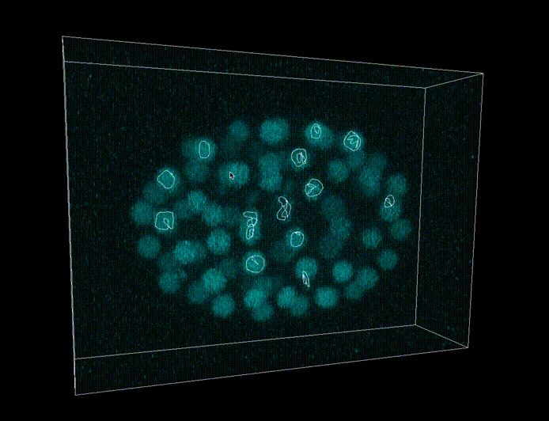

A tool that let's you draw with a 3D pencil on your bioimages.



# to install

Requires [tiff](http://www.libtiff.org/libtiff.html) • [SDL2](https://wiki.libsdl.org/APIByCategory) • and [OpenCL](https://registry.khronos.org/OpenCL/specs/2.2/html/OpenCL_C.html#image-coordinates).
OpenCL comes with macos 10.x. 
Use brew to install tiff and sdl2.
```
brew install sdl2
brew install libtiff
```
Use [zig 10.x](https://ziglang.org/download/) to develop.
Building with `zig build` will install binary `zig-out/bin/biopencil`.


